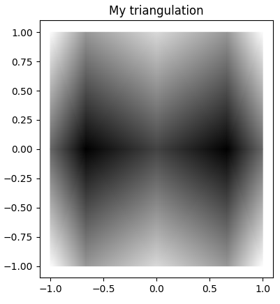
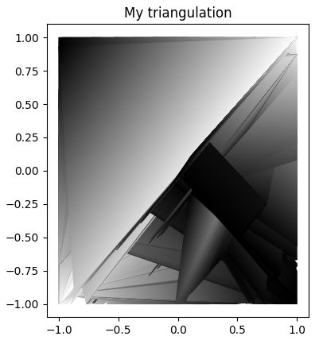

# CS 6170, Final Project Report: Morse-Smale Complexes for Triangulating Images
James Youngblood, u1235424

## Overview
My project primarily involves triangulating images using the Morse-Smale complex. I interpret an image as a 2D Morse-Smale system and compute a Morse-Smale complex, with my hypothesis being that the triangulation could reproduce the image with a relatively low error, because of the properties of the Morse-Smale complex. Upon experimentation, I discovered many hard problems that I had not anticipated, and although further work must be done to fully answer my hypothesis, I believe my hypothesis is unlikely to be correct. My method may still point out directions for further study.

The second goal of my project was to produce a Morse-Smale complex construction algorithm which runs on the GPU. This algorithm is not ready at the time of this submission, due to large project scope and unanticipated problems exceeding my time constraints. I provide my code as-is at [https://github.com/soundeffects/fast_morse_smale_2d](https://github.com/soundeffects/fast_morse_smale_2d) [1].

## Introduction
Images can be triangulated such that we can compress the data required to represent them, or that we can reason on a simplified representation of the image. However, if positions or colors of the triangles are selected poorly, this can reduce the accuracy of the triangulation when compared to the original image. At the start of my project, I hypothesized that the properties of the Morse-Smale complex could improve the accuracy of the triangulation: a Morse-Smale complex will partition a Morse function into monotonic quadrilaterals, and if we were to triangulate those quadrilaterals and linearly interpolate between the color values at each of the corners (which are all critical points), we would construct a piecewise linear approximation of the function. Additionally, images can grow quite large, which can cost a lot of time when computing the Morse-Smale complex. It was because of this, and because of a paper on parallelizing Morse-Smale complex computation for two-dimensional functions (with no publicly available implementation, as far as I know), that I set the goal to implement a GPU algorithm for 2D Morse-Smale complex construction.

## Related Work
There are several papers on triangulation for image compression that I was unaware of at the outset of this project [2] [3] [4] [5]. Although I have not referenced any of these papers while working on this project, since I became aware of them so late into the process, I would absolutely reference them if I were to start this project again to help me gain a better sense of the problem space.

I based my work for the GPU on the paper *Parallel Computation of 2D Morse-Smale Complexes* [6]. This paper describes parallelizable elements for Morse-Smale complex construction which only work for two-dimensional domains. I referenced this paper mostly for the parallel algorithm, but it is also a good introduction to Discrete Morse Theory and Morse-Smale complexes.

For my study on Morse-Smale complex applications, because my own GPU implementation had not been completed, I used a Python package called `morse_smale` [7] to construct the Morse-Smale complex.

## Results
I acheived promising results on simple two-dimensional functions, shown below.

| Figure 2 | <!-- --> |
| --- | --- |
|  |  |
| *This function has two minima towards the center, with a raised saddle point between them, and maxima around the edges.* | *This function has three maxima and three minima, alternating radially around the origin.* |
|  |  |
| *My triangulation displays all of the significant features of the original function.* | *My triangulation displays all of the significant features of the original function.* |

Several difficulties arose when applied to more complex functions, especially those which have dense regions of critical points. Trying to use the algorithm to partition functions like these will cause small, fragmented partition boundaries. Constructing triangulations from these fragmented partitions is difficult, and the more tiny partitions that exist, the less benefits we stand to gain from simplification during the triangulation process. It was also at this point that I realized that the `morse_smale` Python package is not feature complete--it does not return all the critical points within the function but only the partitions. It also did not allow for setting a persistence threshold to ignore insignificant features or noise within the image. I continued to work around these issues with the package, necessitating that I place the critical points myself, which I attempted to do using the partition data, to varying success. I will explain how I place these critical point vertices in more detail as I explain my triangulation algorithm in more detail later on. Looking back, I would use a different Morse-Smale complex implementation, considering the lacking features in the package I used.

| Figure 3 | <!-- --> |
| --- | --- |
|  |  |
| *Several different critical points on the orbits around the center produce several small partitions with high fragmentation.* | *My triangulation produces a somewhat accurate approximation of the function, but with cracks. |
|  |  |
| *This function has a 'minimum line' down the diagonal, where every pixel along that line might be a local minimum. This causes several fragmented, thin regions along the length of the image towards the minima points in the center.* | *My triangulation has produced disorganized triangles, likely connected by vertices technically belonging to contorted or thin partitions. My algorithm which places the boundary vertices for these partitions has likely performed poorly, and so we see no discernable structure to the triangles rendered. I will explain this algorithm later on.* |

I applied my method to real images in order to gauge how problematic the issues I was facing might be for generic data. I sourced data from a webpage at [https://klacansky.com/open-scivis-datasets/](https://klacansky.com/open-scivis-datasets/), which is a collection of volume data for scientific visualization. I will cite these datasets individually where referenced. Even with these images, I continued to face serious issues with dense critical points. At the outset of the project, My hope at the beginning of the project would be that the typical form of certain types of images would not contain too many dense critical points, such that I could find a few niches where my method would perform well. Of images from the datasets I sourced, most produced a number of partitions on the order of the number of pixels (which means the triangulation did not simplify the image). Of those which had few partitions, very few triangulation renders were close to the original upon inspection due to the issues mentioned earlier. Blurring/smoothing the image or using a persistence threshold might reduce the number of partitions, and the triangulation algorithm could be improved by placing critical points better, but these improvements would require a significant amount of time, and I did not have the time to do this before the deadline.

| Figure 5 | <!-- --> |
| --- | --- |
|  |  |
| *A slice of the "Neghip" dataset [8]. Straight-line sections spanning the height of the image will produce long, thin partitions, which we have seen causes issues for the triangulation method.* | *Triangles have been misplaced such that there is no reconstruction of the vertical straight-line patterns.* |
|  |  |
| *A slice of the "Nucleon" [9]. The circular region around the center will likely have many maxima densely packed together, causing problems for partitioning and triangulation.* | *We see that triangles have been misplaced, and do not produce the ring structures seen in the original image.* |

In parallel to my studies in applying Morse-Smale complexes to images, I was developing a parallelized algorithm for Morse-Smale complex construction which ran on the GPU. I implemented a rudimentary testing suite and compute shader pipeline, but did not complete the algorithm due to time constraints. I am submitting the incomplete code as-is [1].

## Methodology
I wrote several Python scripts in order to faciliate my experiments with Morse-Smale complexes, including a script to pre-process the data I gathered into a set of usable images. From the scientific visualization dataset webpage linked earlier, I started with the smallest of the datasets, intending to continue onto larger datasets after resolving any issues with the smaller ones (which never happened). These are all volumes, and my method was only intended for two-dimensional images. I collected a thousand two-dimensional slices from these volumes by randomly selecting a point along any of the three axes, and saved the slice at that point to an image.

| Figure 6 | <!-- --> |
| --- | --- |
|  |  |
| *A slice of the "Fuel" dataset [9]. This is shown as an example of the image slices tested on.* | *A slice of the "Head MRI CISS" dataset [10]. This is shown as an example of the image slices tested on.* |

After receiving a partition of the pixels of the image from the Morse-Smale algorithm, I had to construct triangles based on those partitions. As mentioned earlier, I did not recieve the critical points from my Morse-Smale implementation, so I decided to search the image and partitions per-pixel, and mark each pixel a 'corner' if it is adjacent to two different partitions from it. This will avoid creating corners at boundaries where two partitions meet, but will create a corner in each partition next to the points where three or more partitions meet. Using a Disjoint-set data structure, I join any adjacent corners into a single group, and create a vertex for each corner group. I also create a face for each partition, and assign each vertex to all faces it is adjacent to. With vertices and faces, I then iterate through a face, constructing triangles out of every three vertices until the face is covered, and ordering the vertices in triangles in counter-clockwise order such that they are rendered correctly. When the triangulation is complete, it can trivially be rendered by Python packages such as `matplotlib`.

As mentioned earlier, this algorithm for placing critical points often performed poorly on regions dense critical points. In the case that several critical points are close to each other, their respective corner groups might overlap, causing them to be merged into one vertex in the final triangulation. Because vertices and their faces were removed improperly, the spaces left behind show up as cracks, shown in figure 3. My triangulation algorithm also struggled to deal with long and thin regions. This is because the resulting partitions might be only one pixel wide, and therefore every element in the partition would border two other partitions and be marked as a corner. This would reduce an entire partition to a vertex, causing a complete degradation of the triangluation. Even after some deliberation, I am unsure how to improve performance with thin regions without significant performance costs, so I believe that receiving the critical points/cells from the Morse-Smale complex computation will be a requirement for the triangulation to perform well.

| Figure 7 |
| --- |
|  |
| *This figure depicts the issues in the "corner" selection of my triangulation method for long, thin partitions. Positions (pixels) highlighted in strong red indicate a "corner". Corners are selected when they have two adjacent differing partitions. This selection is intended to isolate meeting points of partitions and exclude partition interiors/edges, but with long thin regions whose interior is only one position wide, it will select interiors as corners, which will cause misplaced triangles.* |

For my GPU algorithm, I chose to approach the problem using compute shaders written in WebGPU shading language (WGSL). Compute shaders are equipped to process data in the way that this problem requires, and writing them in WGSL would allow for cross-platform execution of my code on all major operating systems, GPU vendors, and even in the browser. This was a priority for me, because I am often frustrated by data science and scientific computing repositories where code is not compatible with my operating system or GPU vendor. I chose Rust as the language for the CPU driver of the GPU shader code. Rust has excellent WebGPU support with a library called `wgpu`, which is a framework I am familiar with and have worked with before. The user-facing API of my code consists of a single object which stores GPU context necessary to spin up a new task on the GPU. This object, called a `MorseSmaleSolver`, starts a GPU task by taking a rectangular, regularly sampled region representing the two-dimensional function domain. It writes that input to a buffer on the GPU, invokes a compute shader, and upon completion copies the result back to the CPU in another buffer. Because of limited buffer size, and because I have not implemented multiple-buffer copying, the input may only extend to up to approximately six million 32-bit scalars in total size of the scalar field of input (which would allow me to pass images up to the resolution of about 2500x2500). I wrote a rudimentary testing suite, which verifies that this compute shader pipeline is running with no errors, but the pipeline currently does not perform any useful computation. I intend to complete this code, but due to time constraints I am not able to do so by the time of submission.
s
## Conclusion
Due to several issues described above, I believe my original hypothesis, stating that Morse-Smale complexes and triangulation could be applied to compress images, is unlikely to be true. There are a few deliverables described in my project proposal which remain undelivered. I had intended to present metrics on error and compression ratio for my method, but by visual inspection of my results I have decided that my method is unusable in its current state because the error incurred is intolerable for any practical application. My approach might be improved by using persistence thresholds during the Morse-Smale complex construction to limit the number of critical points and partitions considered. I am also curious as to the possibility of using Morse-Smale complexes in a hybrid algorithm, which would use a different approach for triangulating regions of an image which are not fit well by a Morse-Smale complex.

One of the biggest lessons learned is that I should examine supporting material and previous work better. With a better Morse-Smale complex implementation, providing the features I required, or with a better intuition for the problem space provided by papers on triangulating images, I might have avoided several of the pitfalls I encountered during this project.  

Finally, I learned that combining a difficult research problem and engineering a GPU algorithm within a semester project is overly ambitious. I had not anticipated the difficulty I encountered with the application of Morse-Smale complexes to images, and had instead expected the GPU algorithm to be the most difficult part of the project. When the former started taking most of my time, I delayed and eventually ran out of time for the latter. I prevent my results and the Github repository for my GPU algorithm [1] as-is for this submission, but I intend to continue work on the code in future and release a complete solution.

## References
[1] J. Youngblood, fast_morse_smale_2d, (accessed 2024), GitHub repository, https://github.com/soundeffects/fast_morse_smale_2d.

[2] V. Petrovic and F. Kuester, "Optimized construction of linear approximations to image data," 11th Pacific Conference on Computer Graphics and Applications, 2003. Proceedings., Canmore, AB, Canada, 2003, pp. 487-491, doi: 10.1109/PCCGA.2003.1238300.

[3] L. Demaret, N. Dyn, A. Iske, "Image compression by linear splines over adaptive triangulations," Signal Processing, Volume 86, Issue 7, 2006. Pages 1604-1616, ISSN 0165-1684, doi: 10.1016/j.sigpro.2005.09.003.

[4] B. Lehner, G. Umlauf, B. Hamann, "Image Compression Using Data-Dependent Triangulations," Advances in Visual Computing, ISVC 2007. doi: 10.1007/978-3-540-76858-6_35.

[5] O. Delgado-Friedrichs, V. Robins, A. Sheppard, “Skeletonization and partitioning of digital images using discrete Morse theory”, IEEE Transactions on Pattern Analysis and Machine Intelligence, 37(3), pp. 654-666.

[6] N. Shivashankar, S. M and V. Natarajan, "Parallel Computation of 2D Morse-Smale Complexes," in IEEE Transactions on Visualization and Computer Graphics, vol. 18, no. 10, pp. 1757-1770, Oct. 2012, doi: 10.1109/TVCG.2011.284.

[7] E. McQuinn, morse_smale, (accessed 2024), GitHub repository, https://github.com/uncommoncode/morse_smale.

[8] R. Avila, et. al. "A Diversified System for Volume Research and Development," Proceedings Visualization '94, 1994. pp. 31-38, doi: 10.1109/VISUAL.1994.346340.

[9] Acknolwedgement to volvis.org and SFB 382 of the German Research Council (DFG). Data set accessible at https://klacansky.com/open-scivis-datasets/ (accessed 2024).

[10] Acknowledgment to volvis.org and Dirk Bartz, VCM, University of Tübingen, Germany. Data set accessible at https://klacansky.com/open-scivis-datasets/ (accessed 2024).