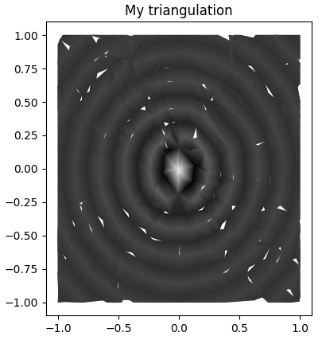

# CS 6635, Final Project Report
Team: James Youngblood, u1235424 (single member).

Project Title: **Imaging Applications for Morse-Smale Complexes**.

## Overview
My project involves taking an image as a function domain and computing a Morse-Smale complex for that function. My initial hypothesis was that we could produce a triangulation based on the Morse-Smale complex, which would compress the original bitmap image without much loss of information, because of the properties of the Morse-Smale complex. Upon experimentation, I discovered many hard problems that I had not anticipated, some of which may not have a workable solution. I argue that these findings disprove my hypothesis. Even though my hypothesis has been disproven, I still consider my project a success because I have gained valuable insights.

The second goal of my project was to produce a Morse-Smale complex construction algorithm which runs on the GPU. This algorithm is not ready at the time of this submission. I will explain why unanticipated problems mentioned earlier cost me the time that I intended to spend on this algorithm. I provide my code as-is at [https://github.com/soundeffects/fast_morse_smale_2d](https://github.com/soundeffects/fast_morse_smale_2d) [1], and intend to complete my algorithm in two weeks, without the expectation that late completion will increase my score.

## Related Work
There are several papers on triangulation for image compression that I was unaware of at the outset of this project [2] [3] [4]. Triangulation is a major component of study in this project, and one that frequently ran into issues. Although I have not referenced any of these papers while working on this project, I would absolutely reference them if I were to start this project again, to help me gain a better sense of the problem space.

I based my work for the GPU on the paper *Parallel Computation of 2D Morse-Smale Complexes* [5]. This paper describes parallelizable elements for Morse-Smale complex construction which only work for two-dimensional domains. I referenced this paper mostly for the parallel algorithm, but it is also a good introduction to Discrete Morse Theory and Morse-Smale complexes.

For my study on Morse-Smale complex applications, because my own GPU implementation had not been completed, I used a Python package called `morse_smale` [6] to construct the Morse-Smale complex.

## Process Journal
First, I will provide a brief definition of the Morse-Smale complex. Morse functions are differentiable functions defined on some manifold. For our purposes, that manifold will be a bounded two-manifold, representing the planar space of an image. The function we will study is the pixel intensity at a given point of the image, which is a scalar field. A Morse-Smale system has a few additional constraints compared to a Morse function, notably that there must be a finite number of critical points. We can construct a Morse-Smale complex on the system, which partitions the manifold into ascending and descending manifolds, as well as intersections of these ascending/descending manifolds.

| Figure 1 |
| --- |
|  |
| *Here is simple visualization of Morse-Smale complex as presented in the paper titled* Parallel Computation of 2D Morse-Smale Complexes [5]. *Note how the corners of the partitions are the critical points of the function, and the partition gradients are monontonic.* 

The partitions of the Morse-Smale complex produce regions with one minimum and one maximum on some corner of the region. The other corners are saddle points. The region can be considered a monotonic function, increasing from the minimum to the maximum. These properties of the Morse-Smale complex are what interested me when proposing this project--by approximating the monotonic function spanning the region as a linear function, we could potentially compress the region without much loss in information. Triangles are a well-understood two-dimensional primitive which I could use to perfom linear interpolation, so I decided that I would triangulate each of the regions of a Morse-Smale complex. We can render the triangulation using Gouraud shading, which linearly blends between the values assigned to each vertex, to reconstruct the image. I acheived promising results on simple two-manifolds.

| Figure 2 | <!-- --> |
| --- | --- |
|  |  |
| *This function has two minima towards the center, with a raised saddle point between them, and maxima around the edges.* | *This function has three maxima and three minima, alternating radially around the origin.* |
|  |  |
| *My triangulation produces the saddle point between the minima when rendered, whereas a Delaunay triangulation on minima and maxima does not.* | *My triangulation produces the saddle point in the center, whereas the Delaunay triangulation on minima and maxima does not.* |

Several difficulties arose when applied to more complex functions. Most Morse-Smale complex implementations discretize the function domain for computation, as is the case with the implementation I used. Morse-Smale systems may contain periodic orbits, but the discretization of the domain makes it difficult to accurately represent periodic orbits. In these cases, the discrete Morse-Smale complex is not well defined, and trying to use the algorithm to partition functions like these will cause small, fragmented partition boundaries. Constructing triangulations from these fragmented partitions is difficult, and loses much of the compression we hoped to gain. Although there are some issues with Morse-Smale complex partitioning in cases like these, there are also issues with my triangulation algorithm, which are dicussed in the **Shortcomings and Lessons Learned** section.

| Figure 3 | <!-- --> |
| --- | --- |
|  |  |
| *Several different critical points on the orbits around the center produce several small partitions with high fragmentation.* | *My triangulation produces accurate approximations of the function, but with cracks. The Delaunay triangulation produces no cracks, but has irregular spots connecting concentric rings when they should not be connected.* |

Recall the definition of a Morse-Smale system: it must have a finite number of critical points or periodic orbits. Among all possible images, there are several with infinite critical points, usually along a the points of a line. These images will also cause fragmented partition boundaries. As shown in the following figure, I attempt to construct a Morse-Smale complex from a function with theoretically infinite minima along a line through the diagonal of the domain. The computation still succeeds, creating finite minima due to the discretization of the space, but the partition is fragmented.

| Figure 4 | <!-- --> |
| --- | --- |
|  |  |
| *This function has a minimum line down the diagonal, where there are infinitely many global minima. This causes several fragmented, thin regions along the length of the image towards the minima points in the center.* | *My triangulation has produced disorganized triangles, likely connected by vertices technically belonging to contorted or thin partitions. These partitions are difficult to place corners for, and so vertices get misplaced. The Delaunay triangulation is more robust.* |

I applied my method to real images in order to gauge how problematic these issues might be on generic data. I sourced data from a webpage at [https://klacansky.com/open-scivis-datasets/](https://klacansky.com/open-scivis-datasets/), which is a collection of volume data for scientific visualization. I will cite these datasets individually where referenced. I continued to face serious issues with ill-defined Morse-Smale systems. At the outset of the project, I had considered that the space of possible images might not map sufficiently well onto the space of well-defined Morse-Smale systems. My hope had been that when considering noise, discretization, and the typical form of certain types of images, I would at least find some niche where my method performs well. Of all images from the datasets I sourced, I could not find an example which showed promise for my method.

| Figure 5 | <!-- --> |
| --- | --- |
|  |  |
| *A slice of the "Neghip" dataset [7]. Straight-line sections spanning the height of the image will produce long, thin partitions, which we have seen causes issues for the triangulation method.* | *Triangles have been misplaced such that there is no reconstruction of the straight-line patterns.* |
|  |  |
| *A slice of the "Nucleon" [8]. The orbit around the center will likely cause problems for partitioning.* | *We see that triangles have been misplaced, and do not produce the ring structures seen in the original image.* |

In parallel to my studies in applying Morse-Smale complexes to images, I was developing a parallelized algorithm for Morse-Smale complex construction which ran on the GPU. I implemented a rudimentary testing suite and compute shader pipeline, but did not complete the algorithm due to time constraints. I am submitting the incomplete code as-is [1].

## Implementation Details
I wrote several Python scripts in order to faciliate my experiments with Morse-Smale complexes, including a script to pre-process the data I gathered into a set of usable images. From the scientific visualization dataset webpage linked earlier, I started with the smallest of the datasets, intending to continue onto larger datasets after resolving any issues with the smaller ones (which never happened). These are all volumes, and my method was only intended for two-dimensional images. I collected a thousand two-dimensional slices from these volumes by randomly selecting a point along any of the three axes, and saved the slice at that point to an image.

| Figure 6 | <!-- --> |
| --- | --- |
|  |  |
| *A slice of the "Fuel" dataset [9]. This is shown as an example of the image slices tested on.* | *A slice of the "Head MRI CISS" dataset [10]. This is shown as an example of the image slices tested on.* |

After receiving a partition of the pixels of the image from the Morse-Smale algorithm, I had to construct triangles based on those partitions. I wanted to bound the complexity of the algorithm to a linear search of the image, without relying on methods like Delaunay triangulation which would depend on the number of partitions or vertices. To do so, I search the image and mark each vertex a 'corner' if it is adjacent to two different partitions from it. This will avoid creating corners at boundaries where two partitions meet, but will create a corner in each partition next to the points where three or more partitions meet. Using a Disjoint-set data structure, I join any adjacent corners into a single group, and create a vertex for each corner group. I also create a face for each partition, and assign each vertex to all faces it is adjacent to. With vertices and faces, I then iterate through a face, constructing triangles out of every three vertices until the face is covered, and ordering the vertices in triangles in counter-clockwise order such that they are rendered correctly. When the triangulation is complete, it can trivially be rendered by Python packages such as `matplotlib`.

For my GPU algorithm, I chose to approach the problem using compute shaders written in WebGPU shading language (WGSL). Compute shaders are equipped to process data in the way that this problem requires, and writing them in WGSL would allow for cross-platform execution of my code on all major operating systems, GPU vendors, and even in the browser. This was a priority for me, because I am often frustrated by data science and scientific computing repositories where code is not compatible with my operating system or GPU vendor. I chose Rust as the language for the CPU driver of the GPU shader code. Rust has excellent WASM and WebGPU support, allowing my code to run in browser if so desired, and I also have familiarity with writing GPU-facing code in Rust. The API of the library consists of a single object which stores GPU context necessary to spin up a new task on the GPU. This object, called a `MorseSmaleSolver`, starts a GPU task by taking a rectangular, regularly sampled region representing the scalar field function for which a Morse-Smale complex should be constructed, as input. It writes that input to a buffer on the GPU, invokes a compute shader, and upon completion copies the result back to the CPU in another buffer. Because of limited buffer size, and because I have not implemented multiple-buffer copying, the input may only extend to up to approximately six million scalars in total size of the scalar field of input. I wrote a rudimentary testing suite, which verifies that this compute shader pipeline is running with no errors, but the pipeline currently does not perform any useful computation. I intend to complete this code, but due to time constraints I am not able to do so by the time of submission.

## Shortcomings and Lessons Learned
Due to several issues, including ill-defined Morse-Smale systems and messy triangulation problems, I believe my original hypothesis, stating that Morse-Smale complexes and triangulation could be applied to compress images, is disproven. Additionally, there are a few deliverables described in my project proposal which remain undelivered. I had intended to present metrics on error and compression ratio for my method, but by visual inspection of my results I have decided that my method is unusable in its current state because the error incurred is intolerable for any practical application. I had hoped that Morse-Smale systems could be derived from a substantial portion of images in common scientific imaging datasets, but based on my findings this seems to be overly optimistic. Constructing Morse-Smale complexes on data which does not match the necessary constraints for a Morse-Smale system causes fragmented partitions and error in the triangulation process.

My biggest lesson from this project is that my assumption should have become its own project: before exploring the usefulness of Morse-Smale systems applied to scientific images, I should instead focus on determining whether Morse-Smale systems can actually be applied to scientific images in a general sense. I might spend more time searching for specific situations where the constraints hold true, I might explore alternate formulations which hold similar properties to the Morse-Smale complex, or I might explore other avenues related to these ideas. which might give more productive results.

Even though fragmented partitions produced by Morse-Smale complexes make triangulation difficult, it should still remain possible to produce a triangulation without cracks with a sufficiently sophisticated algorithm. I considered spending further time improving my triangulation algorithm to achieve this goal, but ultimately I deemed this to be a waste of effort. Several of the images I tested produced a number of partitions on the order of the number of pixels. For such partitions, a triangulation would produce a number of vertices close to the number of pixels, and would then require additional triangle connections to be stored. This would actually expand the size of the data, rather than compress it, which would make this effort an unproductive use of time. My triangulation algorithm also struggled to deal with long and thin regions, even when such regions were not a result of improperly defined Morse-Smale complexes. Even after some deliberation, I am unsure how to improve performance with thin regions without significant performance costs. If solving this problem requires increasing the running time complexity above a linear pass of the image, it would make more sense to put effort into designing a tailored Delaunay triangulation algorithm for our use case instead.

| Figure 7 |
| --- |
|  |
| *This figure depicts the issues in the "corner" selection of my triangulation method for long, thin partitions. Positions (pixels) highlighted in strong red indicate a "corner". Corners are selected when they have two adjacent differing partitions. This selection is intended to isolate meeting points of partitions and exclude partition interiors/edges, but with long thin regions whose interior is only one position wide, it will select interiors as corners, which will cause misplaced triangles.* |

Finally, I learned that combining a difficult research problem and engineering problem within a semester project is overly ambitious. I had not anticipated the difficulty I encountered with the application of Morse-Smale complexes to scientific images, and had instead expected the GPU algorithm to be the most difficult part of the project. When the former started taking most of my time, I delayed and eventually ran out of time for the latter. I am not able to deliver a complete implementation of the Morse-Smale algorithm at the time of this submission--only a framework of my algorithm is present. I provide the Github repository [1] as-is for this submission, but I intend to continue work on the code for the next two weeks, and to hopefully finish before a deadline for another of my classes. If the repository is accessed at that time, the code may be complete.

## Evaluation
Although I have described many shortcomings compared to my expectations for this project, I still believe this project successfully accomplishes my primary goal of discovery. Though failing to check some of my assumptions before embarking on the project is a mistake that cost me time, I don't think the time is wasted, and I believe the work I present opens up many interesting questions, pitfalls to avoid, and improvements to be made. All of these are valuable to myself and others working on similar problems. I also believe some of my findings are generally applicable, such that I will use what I learned in future projects.

The biggest weakness of my project submission is failing to deliver results promised in my proposal. In my proposal, I promised error and compression ratio metrics, and a working GPU implementation of Morse-Smale complex construction verified by a testing suite. Although I explained the reasons why I am unable to deliver these items, the lack of these items still signals poor planning and late communication with course staff, which may decrease the score of my submission.

## References
[1] J. Youngblood, fast_morse_smale_2d, (accessed 2024), GitHub repository, https://github.com/soundeffects/fast_morse_smale_2d.

[2] V. Petrovic and F. Kuester, "Optimized construction of linear approximations to image data," 11th Pacific Conference on Computer Graphics and Applications, 2003. Proceedings., Canmore, AB, Canada, 2003, pp. 487-491, doi: 10.1109/PCCGA.2003.1238300.

[3] L. Demaret, N. Dyn, A. Iske, "Image compression by linear splines over adaptive triangulations," Signal Processing, Volume 86, Issue 7, 2006. Pages 1604-1616, ISSN 0165-1684, doi: 10.1016/j.sigpro.2005.09.003.

[4] B. Lehner, G. Umlauf, B. Hamann, "Image Compression Using Data-Dependent Triangulations," Advances in Visual Computing, ISVC 2007. doi: 10.1007/978-3-540-76858-6_35.

[5] N. Shivashankar, S. M and V. Natarajan, "Parallel Computation of 2D Morse-Smale Complexes," in IEEE Transactions on Visualization and Computer Graphics, vol. 18, no. 10, pp. 1757-1770, Oct. 2012, doi: 10.1109/TVCG.2011.284.

[6] E. McQuinn, morse_smale, (accessed 2024), GitHub repository, https://github.com/uncommoncode/morse_smale.

[7] R. Avila, et. al. "A Diversified System for Volume Research and Development," Proceedings Visualization '94, 1994. pp. 31-38, doi: 10.1109/VISUAL.1994.346340.

[8] No citation provided. Acknolwedgement to volvis.org and SFB 382 of the German Research Council (DFG). Find at https://klacansky.com/open-scivis-datasets/ (accessed 2024).

[9] No citation provided. Acknolwedgement to volvis.org and SFB 382 of the German Research Council (DFG). Find at https://klacansky.com/open-scivis-datasets/ (accessed 2024).

[10] No citation provided. Acknowledgment to volvis.org and Dirk Bartz, VCM, University of Tübingen, Germany. Find at https://klacansky.com/open-scivis-datasets/ (accessed 2024).